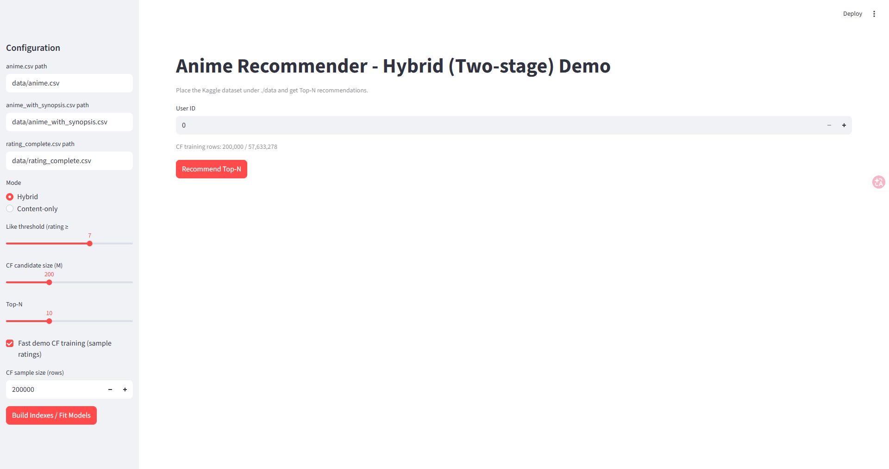
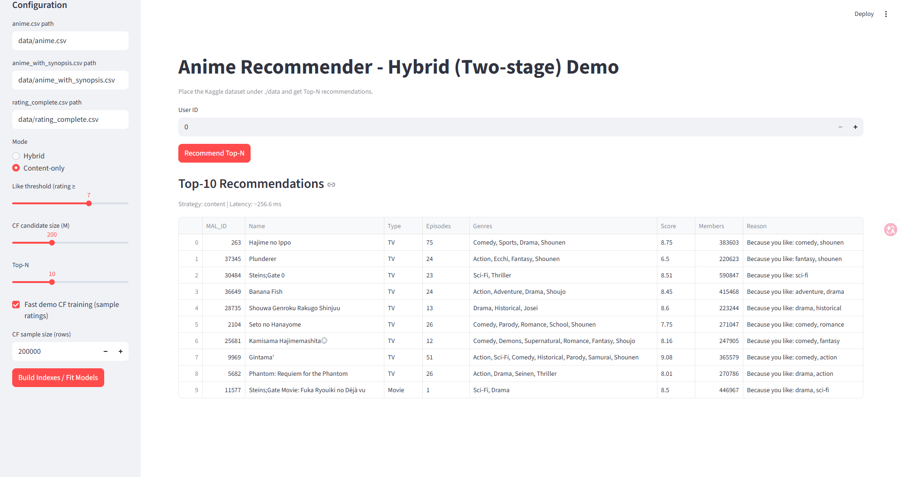
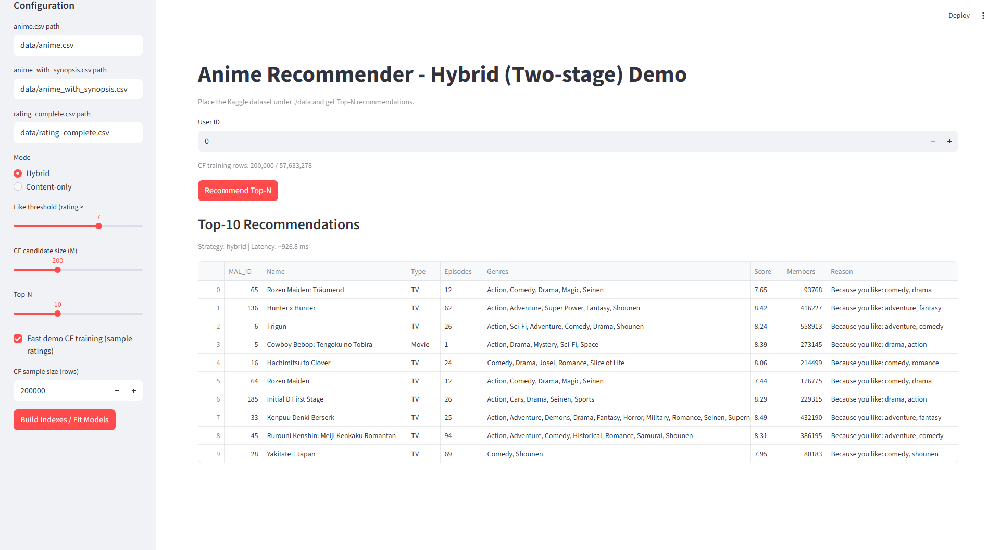

# 🎬 Anime Recommender: Two-Stage Hybrid Recommendation System


A production-style anime recommendation system that combines **Item-Item Collaborative Filtering** with **Content-Based Re-ranking** in a two-stage hybrid architecture.

This project was built to demonstrate scalable recommender system design, feature engineering, offline evaluation, and reproducible deployment.

## 🧠 System Architecture Overview

The system implements an industry-standard two-stage recommendation pipeline to balance scalability and accuracy:

1.  **Stage 1: Candidate Generation (Recall)**
    * **Algorithm:** Item-item K-Nearest Neighbors (KNN) via the `Surprise` library.
    * **Function:** Rapidly filters millions of interactions to generate a Top-M list of highly relevant candidate items per user.
2.  **Stage 2: Content-Based Re-Ranking**
    * **Algorithm:** TF-IDF vectorization (metadata + synopsis) with Singular Value Decomposition (SVD) for dimensionality reduction, combined with numeric features (score, popularity, episodes).
    * **Function:** Ranks the Top-M candidates using Cosine Similarity to produce the final, highly personalized Top-N recommendations.

## ✨ Key Features & Technical Highlights

* **Robust Data Engineering:** Safely handles missing values (e.g., gracefully managing "Unknown" entries without system crashes) and dynamically detects synopsis column variants.
* **Performance Optimization:** Includes a configurable rating sampling mode for faster training during live demos, alongside Streamlit caching to ensure a responsive UI.
* **Comprehensive Offline Evaluation:** Evaluated using industry-standard ranking metrics including `Precision@N`, `Recall@N`, `HitRatio@N`, and `nDCG@N`.
* **Interactive UI & Reproducibility:** Fully interactive frontend built with Streamlit, completely containerized with Docker for seamless, "works-on-my-machine" deployment.

## 📊 Evaluation Results

*The hybrid architecture consistently outperforms the content-only baseline by effectively capturing both user-behavior patterns and item metadata.*

| Model | Precision@10 | Recall@10 | HitRatio@10 |
| :--- | :---: | :---: | :---: |
| Content-Based (Base) | 0.3000 | 0.1100 | 0.6154 |
| Collaborative Filtering (CF) | 0.1778 | 0.0500 | 0.4815 |
| **Two-Stage Hybrid** | **0.5750** | **0.1916** | **1.0000** |

## 📸 Interactive Demo

* **UI Overview:**
  
  

* **Content-Only Results:**
  
  

* **Hybrid Results:**
  
  

## 🚀 Getting Started

### 1. Dataset Preparation
This project utilizes the ~57M interaction [Anime Recommendation Database 2020](https://www.kaggle.com/datasets/hernan4444/anime-recommendation-database-2020) from Kaggle.

Download and place the following required CSV files into the `./data/` directory:
* `data/anime.csv`
* `data/anime_with_synopsis.csv`
* `data/rating_complete.csv`

*(Note: Data files are excluded from version control).*

### 2. Local Installation

```bash
# Clone the repository
git clone [https://github.com/jokerwolf0917/Anime-Recommender.git](https://github.com/jokerwolf0917/Anime-Recommender.git)
cd Anime-Recommender

# Create and activate virtual environment
python -m venv venv
source venv/bin/activate  # On Windows use: venv\Scripts\activate

# Install dependencies
pip install -r requirements.txt

# Launch the app
streamlit run src/app.py